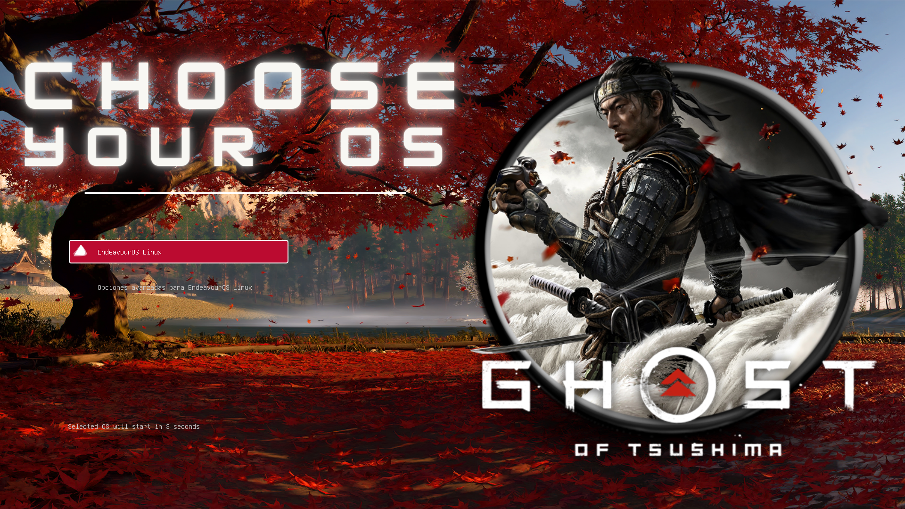
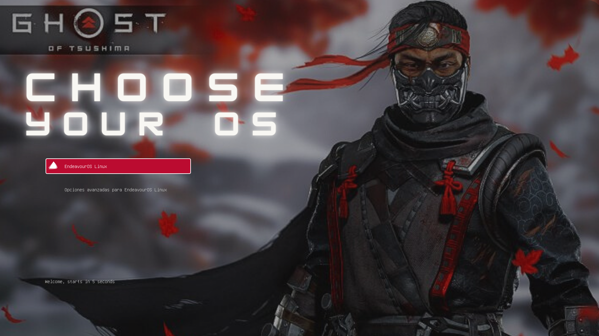

### 🏯 Contents 🏯

<a></a>
<br/><br/>

- <b>[GRUB Themes](#previews)</b>
   - [Ver. 1](#1)
   - [Ver. 2](#2)


- <b>[🔧 Installation](#installation)</b>
  - [First method]()
  - [Second method (wip script, soon)]()


## Installation

<a></a>
- Open your terminal
- Copy the repository or unzip

```
    https://github.com/Zerabalus/Ghost-of-Tsushima-GRUB
```

- cd to where you copied it, on your terminal:
```
 sudo cp -r <theme> /usr/share/grub/themes
```

- Or like in my case (DEBIAN-ARCH)

>Arch/Debian `sudo cp -r <theme> /boot/grub/themes`

- Then edit the name of the grub theme you want:
```
sudo nano /etc/default/grub
```
```
GRUB_THEME="/boot/grub/themes/<theme>/theme.txt"
```
- Update the grub
```
sudo grub-mkconfig -o /boot/grub/grub.cfg
```

- Reboot your pc
```
reboot
```


# Previews
#  Ver. 1
<div align="center" style="display:inline">

</div>

#  Ver. 2
<div align="center" style="display:inline">

</div>